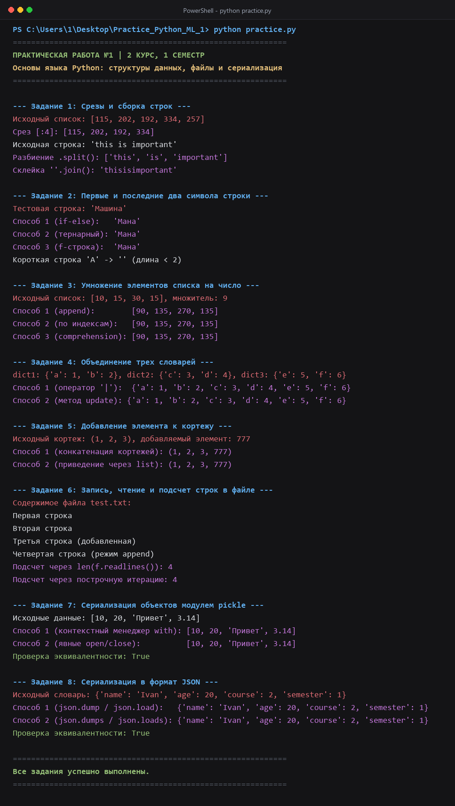
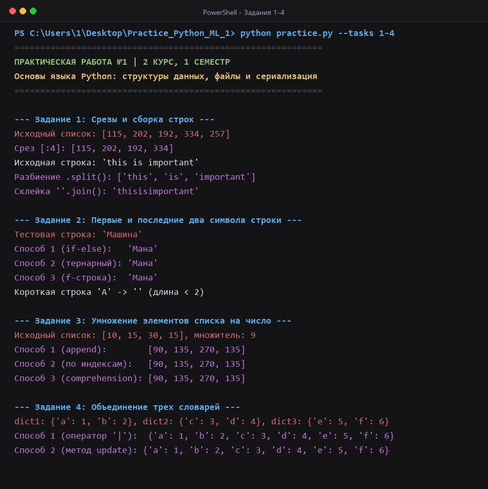
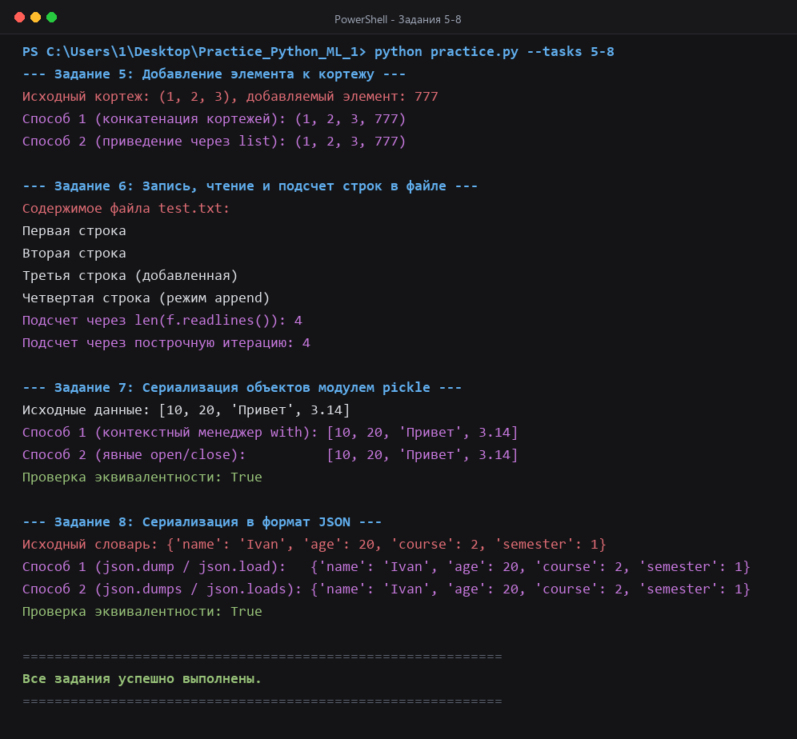

# Практическая работа №1: Базовые структуры данных, ввод-вывод и сериализация в Python

**Дисциплина:** Программирование на Python / Основы машинного обучения  
**Курс:** 2 курс, 1 семестр  
**Реализация:** [`practice.py`](practice.py)  

---

## 1. Цель работы
Освоение базовых конструкций языка Python, работа с коллекциями (строки, списки, словари, кортежи), реализация файлового ввода-вывода и применение стандартных механизмов сериализации данных (`pickle`, `json`).

---

## 2. Структура проекта
```text
Practice_Python_ML_1/
├── practice.py                 # Исходный код с решениями заданий
├── README.md                   # Отчет по практической работе
├── screenshots/                # Снимки экрана с выводом терминала
│   ├── console_output.png      # Полный вывод программы
│   ├── console_tasks_1_4.png   # Вывод заданий 1–4
│   └── console_tasks_5_8.png   # Вывод заданий 5–8
├── scripts/                    # Вспомогательные скрипты
│   └── generate_screenshots.py # Генератор снимков терминала
├── .gitignore                  # Исключение временных файлов из репозитория
└── requirements.txt            # Окружение (стандартная библиотека Python)
```

---

## 3. Содержание выполненных заданий

| № | Тема задания | Исследованные подходы и методы |
|---|---|---|
| **1** | Срезы и манипуляции со строками | Извлечение диапазона элементов `[:4]`, удаление разделителей через `.split()` и метод слияния `"".join()`. |
| **2** | Выборка граничных символов строки | Формирование строки из первых 2 и последних 2 символов с валидацией длины (`len(s) >= 2`): классическое ветвление `if-else`, тернарный оператор, форматирование f-строкой. |
| **3** | Масштабирование элементов списка | Умножение числового списка на скаляр: пошаговое наполнение через `.append()`, модификация копии по индексам `range(len())`, списковое включение (List Comprehension). |
| **4** | Слияние словарей | Объединение трех словарей: оператор слияния `\|` (Python 3.9+) и обновление копии методом `.update()`. |
| **5** | Модификация неизменяемого кортежа | Добавление элемента: конкатенация кортежей `tpl + (item,)` и временное приведение к типу `list` с последующим возвратом в `tuple`. |
| **6** | Файловый ввод-вывод | Запись, дозапись (режим `'a'`), чтение содержимого. Подсчет строк: загрузка всех строк в память через `len(f.readlines())` и поточная итерация по файловому объекту (O(1) по памяти). |
| **7** | Бинарная сериализация (`pickle`) | Сохранение и восстановление структуры данных: безопасное использование контекстного менеджера `with` vs явные вызовы `open()` / `close()`. |
| **8** | Сериализация в формат JSON | Работа со структурированными данными: потоковая запись/чтение (`json.dump` / `json.load`) vs строковая сериализация (`json.dumps` / `json.loads`). |

---

## 4. Инструкция по запуску

Программа написана с использованием стандартной библиотеки Python (версия 3.9+) и не требует установки сторонних пакетов для выполнения базового скрипта.

1. Клонировать репозиторий:
   ```bash
   git clone https://github.com/Mesokiiii/Practice_Python_ML_1.git
   cd Practice_Python_ML_1
   ```

2. Запустить скрипт с решениями:
   ```bash
   python practice.py
   ```

---

## 5. Результаты выполнения

Ниже представлен снимок экрана консоли при запуске `practice.py`:



<details>
<summary>Просмотр результатов по блокам заданий</summary>

### Задания 1–4 (Срезы, строки, списки, словари)


### Задания 5–8 (Кортежи, файлы, Pickle, JSON)


</details>

---

## 6. Выводы
В ходе выполнения работы были закреплены навыки использования основных типов данных и конструкций Python. Проведено сравнение производительности и читаемости альтернативных реализаций: списковые включения и операторы слияния (`|`) обеспечивают более лаконичный код, контекстный менеджер `with` гарантирует корректное закрытие файловых дескрипторов при любых исключениях, а поточные методы работы с файлами обеспечивают эффективное использование оперативной памяти.
